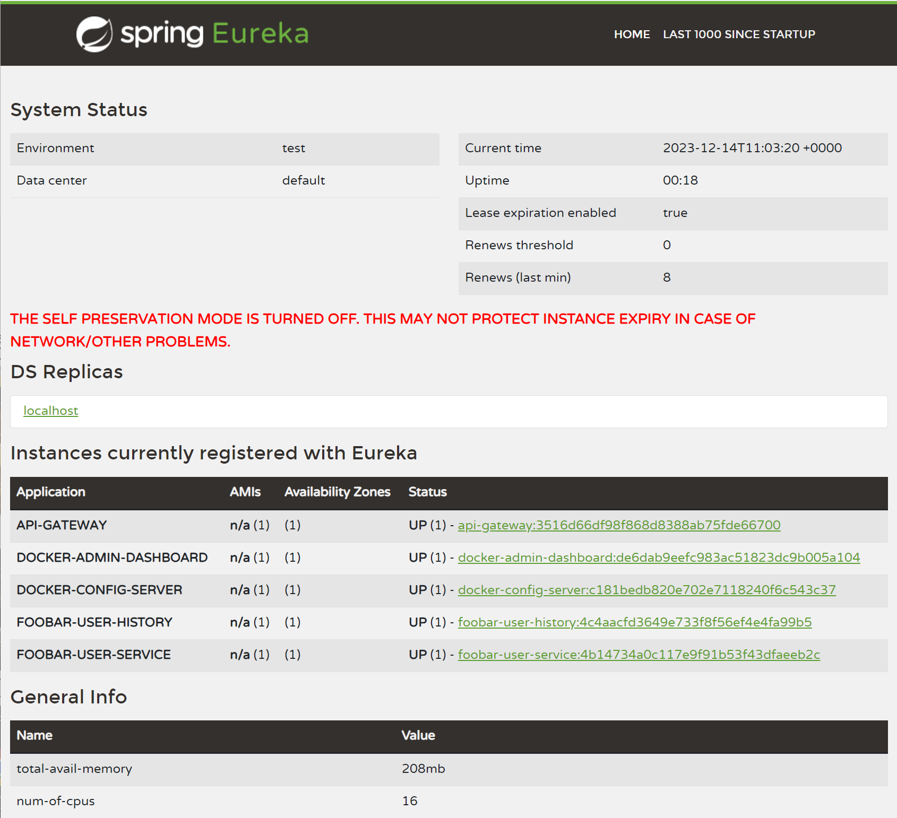
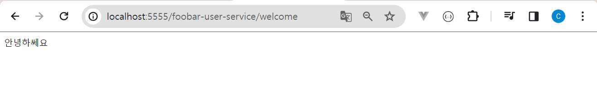
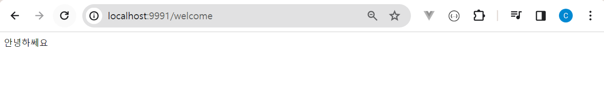
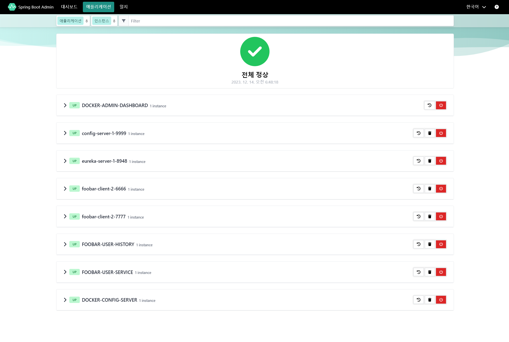
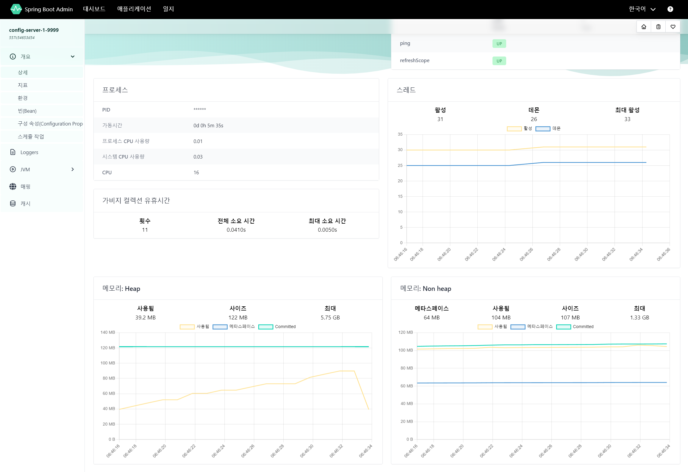
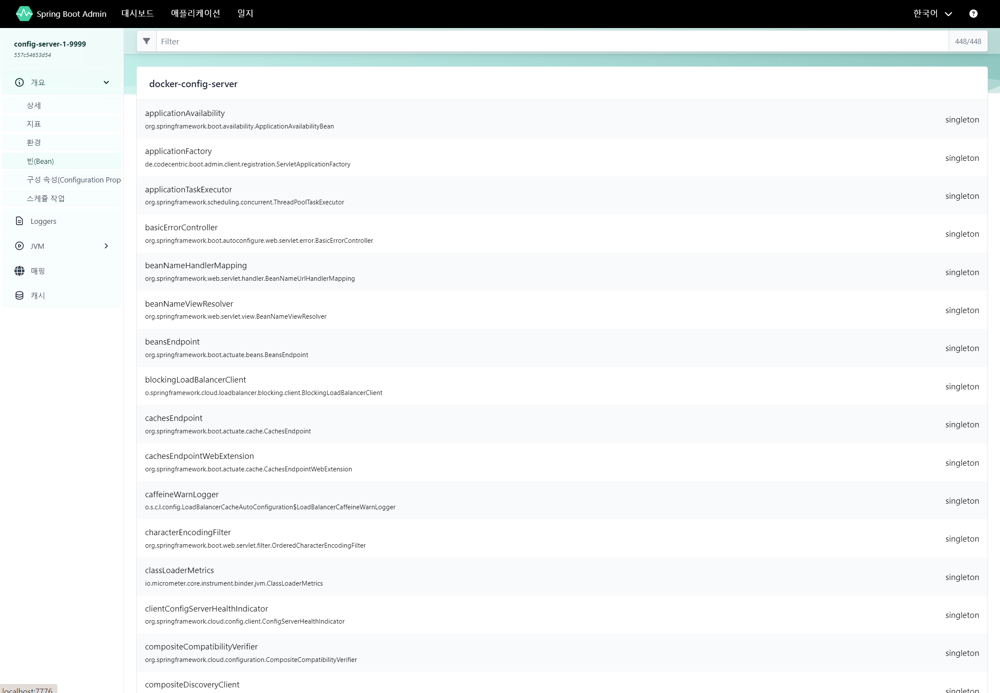
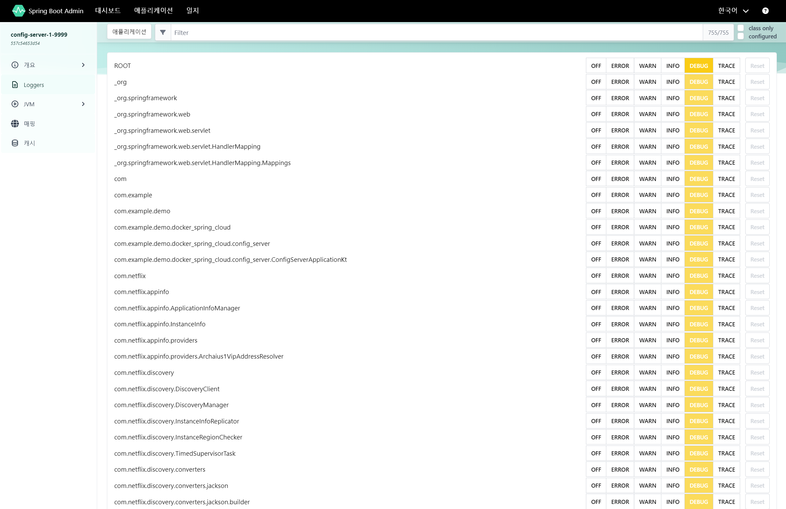
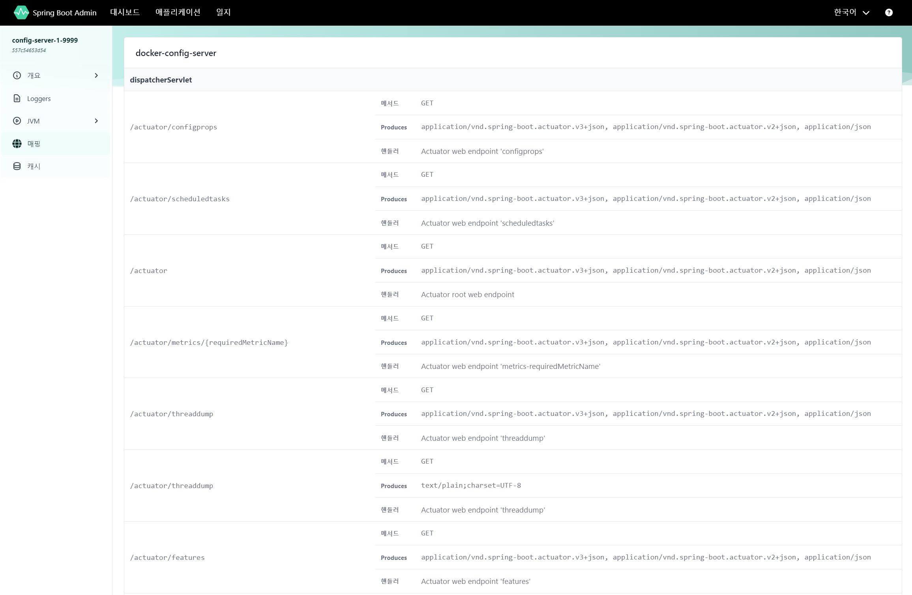
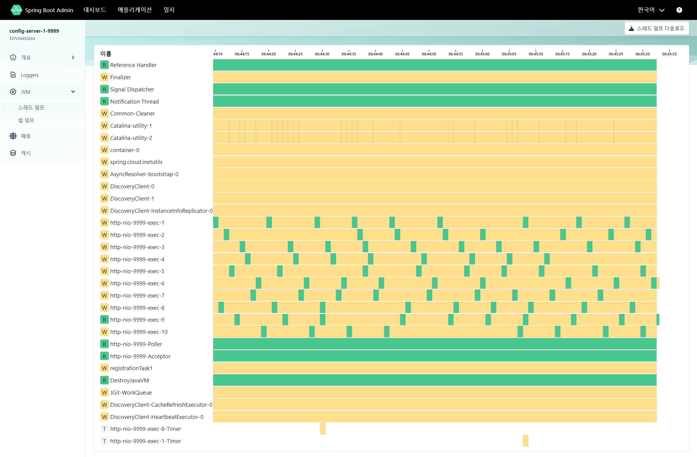

### Screenshot

#### api-gateway

 

#### foobar-user-service

[http://localhost:5555/foobar-user-service/welcome](http://localhost:5555/foobar-user-service/welcome) 

브라우저 접근 → api-gateway → foobar-user-service (Router 를 통한 접근)

 

[http://localhost:9991/welcome](http://localhost:9991/welcome) 

브라우저 접근 → foobar-user-service (직접 접근)

 

#### foobar-user-history

생략

 

#### admin-dashboard

 

 

 

 

 

 

 

### 포트 사용정보

흐아아... 잠깐 쉬었다가 정리예정 휴...

