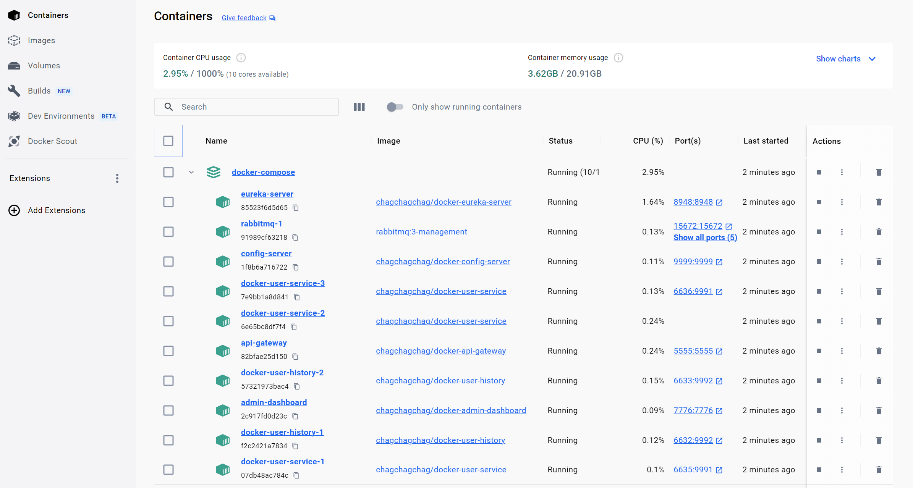
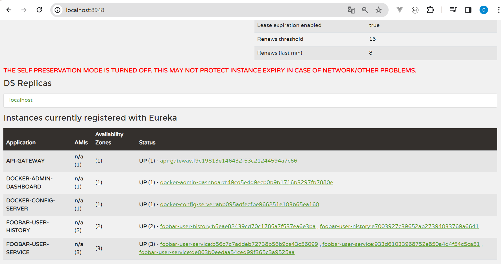

### Screenshot

#### api-gateway


<br>

#### foobar-user-service

[http://localhost:5555/foobar-user-service/welcome](http://localhost:5555/foobar-user-service/welcome)<br>

브라우저 접근 → api-gateway → foobar-user-service (Router 를 통한 접근)


<br>


[http://localhost:9991/welcome](http://localhost:9991/welcome)<br>

브라우저 접근 → foobar-user-service (직접 접근)


<br>


#### foobar-user-history

생략

<br>


#### admin-dashboard


<br>


<br>


<br>


<br>


<br>


<br>


<br>


#### compose 스케일링

조금 뒤에도 명령어를 다루겠지만, docker-compose 스케일링을 위해서는 아래의 명령어를 수행하면 된다.

```bash
docker-compose up --scale docker-user-history=2 --scale docker-user-service=3 -d
```

<br>

scaling 이 된 docker-compose container 들은 아래와 같다.



자세히 보면 docker-user-service 는 인스턴스가 3 개이고 docker-user-history 는 인스턴스가 2개임을 확인 가능하다.<br>

<br>


접근이 잘 되는지 브라우저에서 확인해보면, 역시 잘 수행된다.



<br>

이번에는 api-gateway 를 통해서도 접근이 가능한지 확인해보자. 정상적으로 접근이 잘 된다.


<br>


### 포트 사용정보

포트번호를 일반적으로 사용하는 8000, 8761 등으로 사용하지 않은 이유는 윈도우에 예약된 포트... 때문에 어쩔수 없이 아래처럼 지정했습니다.. 휴... 맥북을 하나 살까 하고 잠깐 미친생각이 들긴 했는데 일단 충동을 참았습니다. 하하하.<br>

- foobar-user-history
  - port : 9992
- foobar-user-service
  - port : 9991
- spring-cloud
  - admin-dashboard 
    - port : 7776
  - api-gateway
    - port : 5555
  - config-server
    - port : 9999
  - eureka-server
    - port : 8948

<br>


### 실행

#### 싱글인스턴스 실행

```bash
cd docker-compose
source run-compose.sh
```

<br>


#### 스케일링된 멀티 인스턴스 실행

```bash
cd docker-compose
source run-scaled-compose.sh
```

<br>
